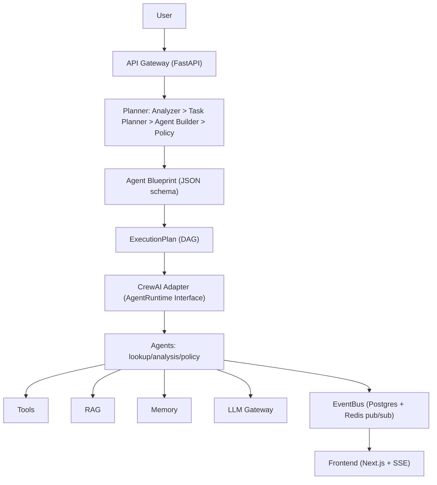

# RAG-Automation — Enterprise Agent Platform (Architecture-First Scaffold)

> Nâng cấp từ CLI RAG đa sàn (CrewAI hierarchical) lên Modular Monolith + Workers + Redis + Postgres + pgvector. Phase này: **architecture-first, KHÔNG code tính năng hàng loạt** — chỉ skeleton/config để repo vẫn chạy.

## 1. Overview
- Hệ thống RAG đa sàn TMĐT (Shopee/TikTok Shop/P2P): tra cứu đơn/sản phẩm, phân tích doanh thu, tra cứu chính sách — tiếng Việt, format VNĐ.
- Code cũ giữ nguyên giá trị: `agents.py` (lookup/analysis/policy/manager), `crew.py` (hierarchical crew), `tools/*_tools.py` (4 tools), `data/*.json` (seed).
- Mục tiêu: API + Planner + Blueprint + ExecutionPlan + CrewAI Adapter + Tools/RAG/Memory/LLM + EventBus + Frontend (SSE).

## 2. Architecture

- Modular Monolith, cấm microservices sớm (ADR-001). CrewAI chỉ sau Adapter (ADR-002). Postgres system of record (ADR-003), pgvector MVP → Qdrant (ADR-004), Redis queue (ADR-005), SSE (ADR-006), row-level isolation (ADR-007), Blueprint JSON (ADR-008).
- Chi tiết: `docs/architecture/` (19 file) + nguồn sâu `D:\Downloads\files\docs\architecture\` (00-24,26,28,29,30,33, REVIEW).

## 3. Structure
```
docs/architecture/      # 19 file: system-overview..devops + repository-analysis.md
backend/                # 18 domain: api/auth/agents/planner/crewai/workflows/execution/rag/memory/tools/llm/context/policy/database/events/observability/evaluation/tests
frontend/               # 11 domain: api/routing/auth/design-system/layouts/pages/components/state/realtime/services/tests
infrastructure/         # 6 domain: docker/postgres/redis/vector/monitoring/deployment + docker-compose.yml
.github/workflows/ci.yml
tools/ data/ agents.py crew.py main.py   # code cũ (giữ, không phá)
```
- Mỗi domain: `README.md` (13 mục) + `*-plan.md` (21 mục) đủ để coding agent implement không đoán.

## 4. Frontend
- Next.js App Router + typed API client + SSE realtime (`frontend/realtime/`). Xem `docs/architecture/frontend.md` + `frontend/*/README.md`.

## 5. Backend
- FastAPI modular monolith + Celery/Arq workers. Skeleton chạy: `backend/api/main.py` (`/health`, `/api/v1/health`). Xem `docs/architecture/backend.md`.

## 6. Agent
- Static/Configurable ưu tiên, Dynamic có kiểm soát (Validation Pipeline). Blueprint JSON schema. Xem `docs/architecture/agent.md` + `backend/agents/`.

## 7. Planner
- Analyzer → Planner → Builder → Policy → ExecutionPlan DAG. Xem `docs/architecture/planner.md` + `backend/planner/`.

## 8. CrewAI
- Mọi gọi CrewAI qua `AgentRuntime` + Adapter; `FakeRuntime` cho test. Code cũ `agents.py`/`crew.py` là seed. Xem `docs/architecture/crewai.md` + `backend/crewai/`.

## 9. RAG
- Hiện tại là JSON keyword search → migrate ingest→chunk→embed→pgvector→retrieve (filter `tenant_id` query-time)→rerank→generate. Giữ text gốc để re-index lên Qdrant. Xem `docs/architecture/rag.md` + `backend/rag/`.

## 10. Workflow
- DSL + DAG + HITL approval (theo 29-workflow-dsl). Xem `docs/architecture/workflow.md` + `backend/workflows/`.

## 11. Execution
- Run/RunStep/RunEvent, Redis queue, idempotency, DLQ skeleton. Xem `backend/execution/`.

## 12. Memory
- Ngắn hạn Redis + dài hạn Postgres+vector, consent + TTL, isolate theo tenant. Xem `backend/memory/`.

## 13. Tools
- 4 tools cũ → Tool Registry có RBAC + audit. Xem `backend/tools/` + `tools/*.py`.

## 14. LLM
- Gateway đa provider, routing/fallback, budget control (33). Xem `backend/llm/`.

## 15. Security
- JWT + RBAC + RLS (`organization_id` từ server context), RAG filter query-time, secret qua env, cấm commit `.env`. Xem `docs/architecture/security.md`.

## 16. Setup
1. `cp .env.example .env` rồi điền `OPENAI_API_KEY`
2. `pip install -r requirements.txt`
3. `python main.py` (CLI cũ vẫn chạy)
4. `uvicorn backend.api.main:app --port 8000` (skeleton API)
5. `docker compose -f infrastructure/docker-compose.yml up postgres redis` (hạ tầng)

## 17. Testing
- `python -m compileall backend tools agents.py crew.py main.py`
- `pytest -q` (skeleton contract tests theo từng `*-plan.md#tests`)
- Frontend: `npm run test` (MSW mocks). Ngưỡng pass ở `*-plan.md#acceptance`.

## 18. Deploy
- Dev: compose. Prod skeleton: `infrastructure/deployment/` (K8s manifests) + `infrastructure/monitoring/` (Prometheus/Grafana/OTEL). CI: `.github/workflows/ci.yml`.

## 19. Roadmap
- Foundation → Auth → Agent → Planner → Workflow → CrewAI → Execution → RAG → Memory → Tools → LLM → Context → Policy → Events → Observability → Evaluation → Frontend (theo `*-plan.md` ưu tiên + `23-implementation-roadmap.md` nguồn).

## Status
`scaffold` — 35 `*-plan.md` + 35 domain `README.md` + 19 arch docs + `repository-analysis.md`. Coding agent tiếp nhận từng plan để implement, cross-check caller/callee + DB/event/API/test/acceptance, không để code tự đẻ architecture ngược.
